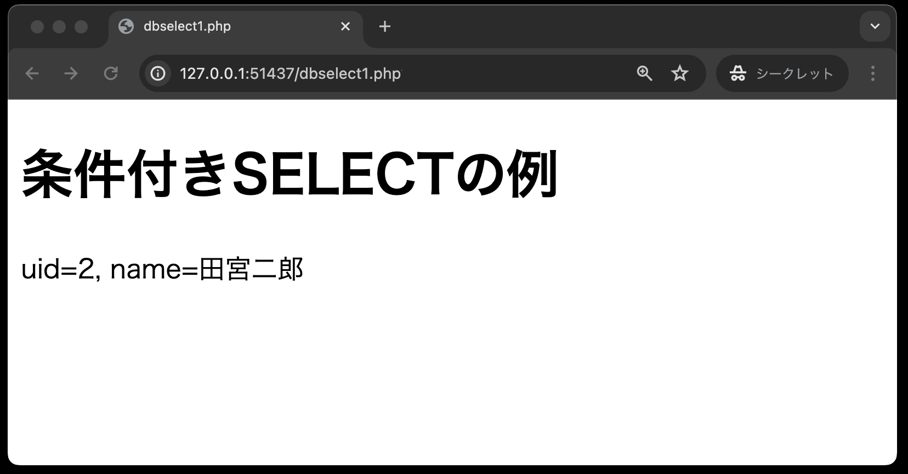
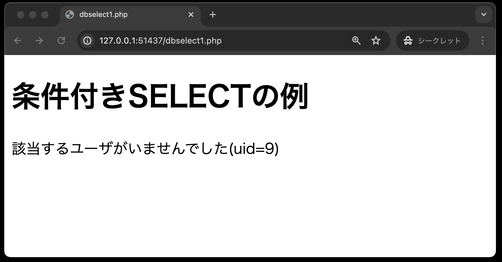
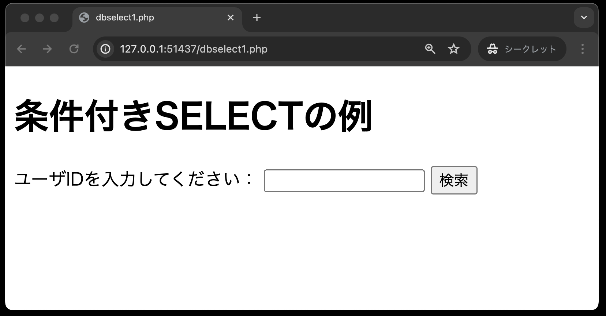

# 課題について

この課題では、条件付きSELECT文を用いて、データベースから特定のデータを抽出するプログラムを作成します。

## 条件付きSELECT文

「データベースの利用(SELECT文)」では、対象となるテーブルのすべてのデータを抽出しました。
ですが、実際にはある条件でデータを抽出するほうがよく使われます。

ここでは、ユーザーID（uid）を条件とし、データを抽出する検索ページを作成します。

1. `person`テーブルにデータのあるユーザーIDを入力し、「検索」ボタンを押した時<br>
→該当する`uid`と`name`が表示される



1. `person`テーブルにデータのないユーザーIDを入力し、「検索」ボタンを押した時<br>
→該当するデータが無い旨のメッセージが表示される



1. ユーザーIDを入力せず、「検索」ボタンを押した時<br>
→検索フォームが表示のまま



**dbselect1.php**

以下は、穴埋め問題になっています。

```php
<!DOCTYPE html>
<html lang="ja">

<head>
    <meta charset="UTF-8">
    <meta name="viewport" content="width=device-width, initial-scale=1.0">
    <title>dbselect1.php</title>
</head>

<body>
    <h1>条件付きSELECTの例</h1>
    <?php
    // (穴埋め)もしも送られてきたuidのデータが空なら、uidを求めるフォームを表示
    if (                    ) {
    ?>
        <form action="dbselect1.php" method="POST">
            <input type="text" name="uid">
            <input type="submit" value="検索">
        </form>
    <?php
    } else {
        // データベースに接続
        // (穴埋め)データベースの接続アカウント情報
        $user = 
        $password = 
        $host = 
        $dbName = 
        $dsn = 

        try {
            // (穴埋め)PDOを用いてデータベースに接続する
            $pdo = 
        } catch (PDOException $e) {
            // 接続できなかった場合のエラーメッセージ
            exit('データベースに接続できませんでした：' . $e->getMessage());
        }

        // (穴埋め)SQLプレースホルダーを作成: uidをキーにして、受け取ったuidを代入
        $uid = 
        // (穴埋め)SQLの定義: personテーブルからuidが一致するレコードを取得する
        $sql = 
        $stmt = $pdo->prepare($sql);
        // (穴埋め)SQLプレースホルダーに値を代入
        $stmt
        // (穴埋め)一件だけなのでfetch()を使って結果レコードを取得
        $result = 
        // 結果が空ならば、該当するユーザがいない旨を表示
        if (empty($result)) {
            echo '該当するユーザがいませんでした(uid=' . $uid . ')';
        } else {
            // 結果があれば、uidとnameを表示
            echo 'uid=' . $result['uid'] . ', name=' . $result['name'];
        }
        // データベースを切断する
        $pdo = null;
    }
    ?>

</body>

</html>
```

```tip
### `fetch()`の補足説明

SELECT文の実行結果に応じて `fetchAll( )` と `fetch( )` の使い分けが必要です。

今回の検索条件ユーザーID(`uid`)は、`person`テーブルの**主キー**であり、取得データは**必ず1件のみ**です。
このように、取得データが1件のみと確定している場合は、`fetch( )`を使用します。

`fetchAll( )`は、1件以上取得データがある場合に使用します。

また、`fetch( )`の戻り値は「1件の連想配列」であるため取得したデータから`uid`などの要素を取り出す場合は**ループ処理は不要**です。
以下にそれぞれの違いを表にまとめております。

|  メソッド名 |取得データ|戻り値|要素を取り出す際のループ処理|
|---------|---------|-----------|------------|
|fetch|1件のみ|1件の連想配列|不要|
|fetchAll|1件以上|1件以上の連想配列|必要|
```


## 合格基準

- dbselect1.phpにて、データが正しく抽出されること

## 合格確認方法

1. pushし、課題を提出する
2. 再度[本章リモートリポジトリ]()にアクセスする<br>
3. 画面上部にある`Actions`をクリック<br>

1. **一番上**の行に、緑色のチェックが入っていればOK<br>


## エラーが出た時の対処法

自動採点がエラーになると、**一番上**の行に赤いばつ印がでます。その場合の解決策を以下に示します。

## タイムアウトになっていないかを確認する

※右端の赤枠で囲まれている箇所に処理時間がでますが、**4分前後**かかっている場合には、まずタイムアウトの可能性を疑ってください。


具体的なタイムアウトの確認・解決方法は、

  1. `Actions`のタイトルが以下のようにリンクになっているので、クリック
      
  2. `run-autograding-tests.png`をクリック
   
  3. 赤いばつ印が出ている箇所をクリック
  
  1. `::error::Setup timed out in XXXXXX milliseconds`のメッセージがあればタイムアウト
   
  6. 解決策としては、右上に`Re-run jobs`(再実行)のボタンがあるので、`Re-run failed jobs`(失敗した処理だけ再実行)をクリックする。
  <br>
  
  7. タイムアウトにならず3分以内に処理が終了したらOK。※タイムアウトでないエラーは、次の解決策を参照。

### プログラムが正確に書かれているか確認する

プログラムが正確に書かれているかを確認してください。
たとえ、ブラウザの画面でそれらしく表示されても、自動採点なので融通は効きません。
