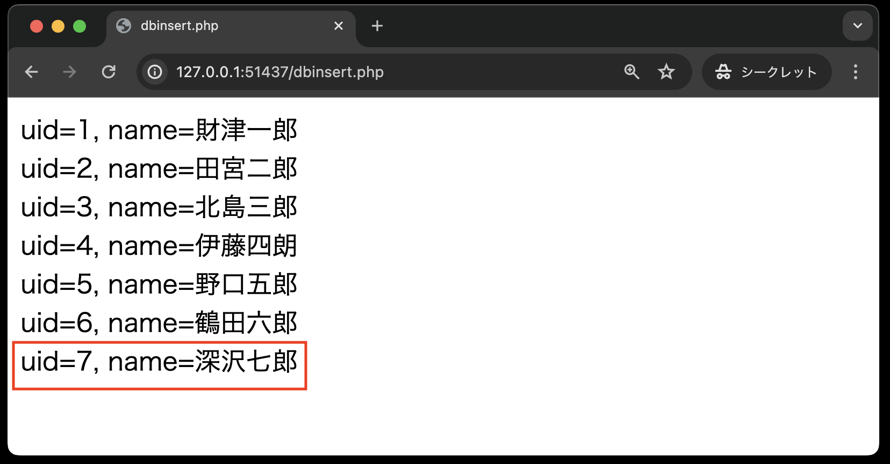

# INSERT文

INSERT文もUPDATE文と同様に、**「?」（プレースホルダ）**　を利用してSQL文を定義します。

**dbinsert.php**



```php
<!DOCTYPE html>
<html lang="ja">

<head>
    <meta charset="UTF-8">
    <meta name="viewport" content="width=device-width, initial-scale=1.0">
    <title>dbinsert.php</title>
</head>

<body>
    <?php
    // データベースの接続アカウント情報
    $user = 'sampleuser';
    $password = 'samplepass';
    $host = 'db';
    $dbName = 'SAMPLE';
    $dsn = 'mysql:host=' . $host . ';dbname=' . $dbName . ';charset=utf8';

    try {
        // PDOを用いてデータベースに接続する
        $pdo = new PDO($dsn, $user, $password);
    } catch (PDOException $e) {
        // 接続できなかった場合のエラーメッセージ
        exit('データベースに接続できませんでした：' . $e->getMessage());
    }

    // --- データの挿入
    // プレースホルダーを用いてpersonテーブルに値を挿入するSQL文を定義・・・①
    $sql = 'INSERT INTO person (name, company_id, age) VALUES (?, ?, ?)';
    $stmt = $pdo->prepare($sql); // ②
    // $stmtを使い、プレースホルダーに値を入れてSQL文を実行する・・・③
    // name = 深沢七郎, company_id = 3, age = 29
    $stmt->execute(['深沢七郎', 3, 29]);

    // --- 結果の取得
    // SQLの定義: personテーブルから全てのレコードを取得する
    $sql = 'SELECT * FROM person';

    // $pdoを用いて$sqlを実行する
    $stmt = $pdo->query($sql);
    // 実行結果を $results に格納する
    $results = $stmt->fetchAll();
    // 配列をループして、各要素を出力する 'uid=UID, name=NAME'の形式で
    foreach ($results as $row) {
        echo 'uid=' . $row['uid'] . ', name=' . $row['name'] . '<br>';
    }
    // データベースを切断する
    $pdo = null;
    ?>

</body>

</html>
```

**【解説】**

①: `$sql = 'INSERT INTO person (name, company_id, age) VALUES (?, ?, ?)';`<br>
INSERT文を定義するときも、値の部分を「?」（プレースホルダ）を用いて記述します。
最初の「?」が「`name`」、2番目の「?」が「`company_id`」、3番目の「?」が「`age`」の値に対応します。
なお、`person`テーブルのカラム`uid`については、自動採番(auto increment)のため、省略できます。

②: `$stmt = $pdo->prepare($sql);`<br>
定義したSQL文をデータベースに送信する前に`PDO`クラスの `prepare( )` メソッドを実行し、 `PDOStatement`クラスのオブジェクトを作成します。

③: `$stmt->execute( ['深沢七郎',  3,  29] );`<br>
作成した`PDOStatement`クラスの `execute( )` メソッドで実際にデータベースへSQL文を送信します。
このとき、「?」（プレースホルダ）の部分に値を代入するため、配列の形式でデータを引数として渡しますが、「?」（プレースホルダ）の順番と配列のデータの順番を対応させるよう注意してください。
このサンプルコードでは、次のように値を代入しています。

|値|「?」の順番|項目（列名）|
| - | - | - |
|深沢七郎|1番目|name|
|3|2番目|company_id|
|29|3番目|age|

③の行以降は、`dbselect.php`と同じ処理内容で、`person`テーブルの全データを表示する処理を行っています。
