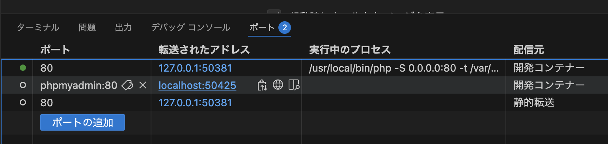
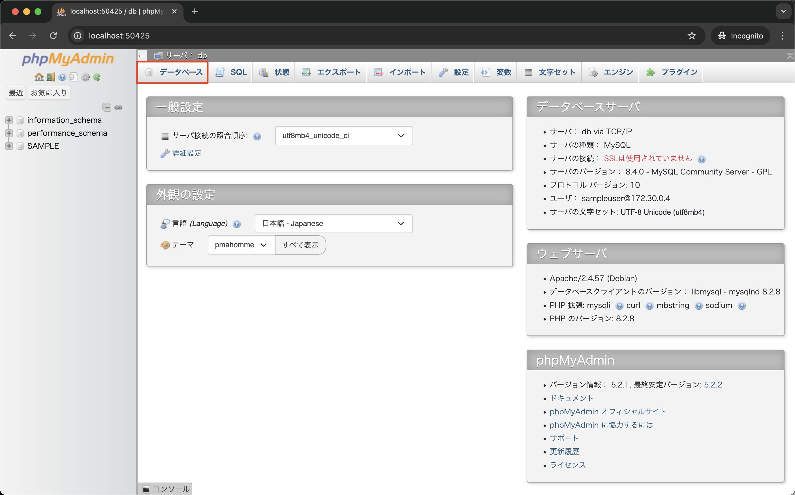
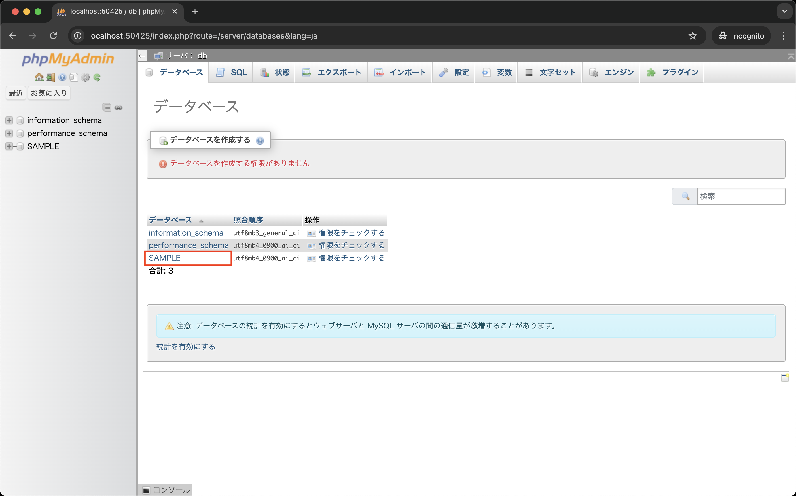
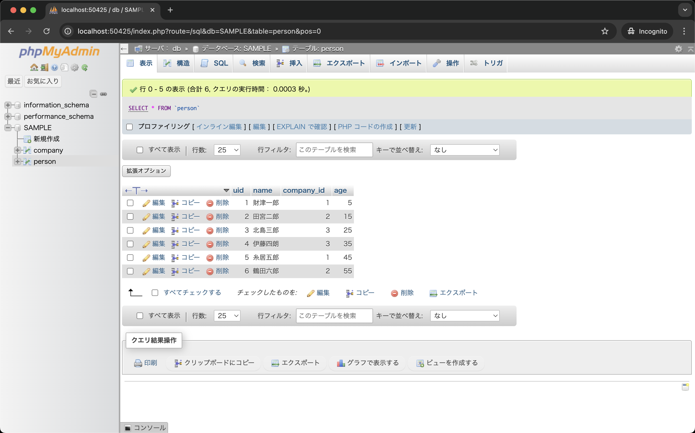

# phpMyAdminについて

データベースを利用するプログラミングを学ぶ前に、データベースを操作するためのツールであるphpMyAdminの使い方を紹介します。

phpMyAdminは、データベースをWebブラウザから操作するためのGUIツールです。
cloneした環境には、既にphpMyAdminとデータベース環境が構築されているので、試しに使ってみましょう。

## phpMyAdminの起動

以下の手順からphpMyAdminを起動し、データベース、テーブルの確認を行います。

1. コンテナを起動
2. ポートの`phpmyadmin:80`の行から、地球儀アイコンをクリック 
   {: style="width: 660px;height: auto;" }
3. ブラウザが立ち上がるので、「データーベース」をクリック 
   {: style="width: 660px;height: auto;" }
4. データベースの一覧が表示されるので、「SAMPLE」データベースをクリック 
   {: style="width: 660px;height: auto;" }

## 本章のデータベース環境について

### ◆personテーブル

`person`テーブルは、以下のカラムを持つものとします。

* `uid`: int型、主キーとして設定、 auto_increment付き
* `name`: varchar型、最大文字数20
* `company_id`: int型
* `age`: int型

初期値として、以下のレコードを挿入されています。
なお`uid`は**自動採番(auto_increment)**されるため省略しています。

|  name |company_id|age|
|-------|---------:|--:|
|財津一郎|          1| 5|
|田宮二郎|          2|15|
|北島三郎|          3|25|
|伊東四朗|          3|35|
|糸井五郎|          1|45|
|鶴田六郎|          2|55|

phpMyAdminを使って、`person`テーブルのデータを確認してみましょう 
{: style="width: 660px;height: auto;" }

### ◆companyテーブル

`company`テーブルは、以下のカラムを持つものとします。

* `cid`: int型、主キーとして設定、 auto_increment付き
* `name`: varchar型、最大文字数20
* `address`: varchar型、最大文字数40

初期値として、以下のレコードが挿入されています。
なお `cid` は自動採番(auto_increment)されるため省略しています。

|  name |address          |
|-------|-----------------|
|東京商事|東京都中央区中央1-1-1|
|大阪商会|大阪市北区中之島2-2-2|
|神戸工業|神戸市中央区三宮町3-3-3|

phpMyAdminを使って、`company`テーブルのデータを確認してみましょう 
{: style="width: 660px;height: auto;" }
