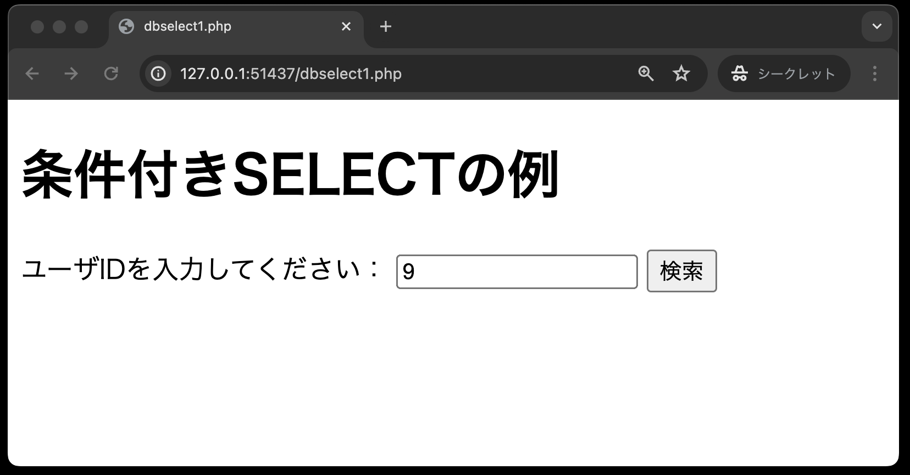
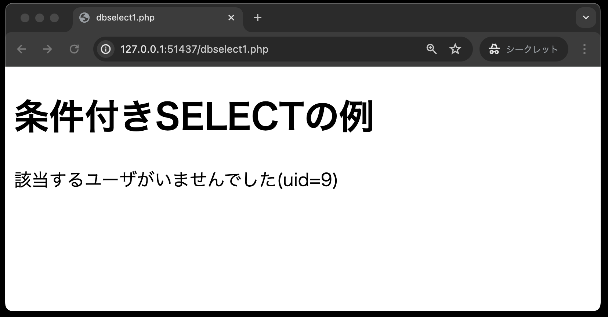

# 条件付きSELECT文

「データベースの利用(SELECT文)」では、対象となるテーブルのすべてのデータを抽出しました。
ですが、実際にはある条件でデータを抽出するほうがよく使われます。

ここでは、ユーザーID（uid）を条件とし、データを抽出する検索ページを作成します。

1. `person`テーブルにデータのあるユーザーIDを入力し、「検索」ボタンを押した時<br>
→該当する`uid`と`name`が表示される


1. `person`テーブルにデータのないユーザーIDを入力し、「検索」ボタンを押した時<br>
→該当するデータが無い旨のメッセージが表示される



1. ユーザーIDを入力せず、「検索」ボタンを押した時<br>
→検索フォームが表示のまま


**dbselect1.php**

以下のサンプルプログラムは

```php
<!DOCTYPE html>
<html lang="ja">

<head>
    <meta charset="UTF-8">
    <meta name="viewport" content="width=device-width, initial-scale=1.0">
    <title>dbselect1.php</title>
</head>

<body>
    <h1>条件付きSELECTの例</h1>
    <?php
    // もしも$_GET['uid']が空なら、uidを求めるフォームを表示(GETメソッド使用)
    if (                   ) {
    ?>
        <!-- 検索フォームを以下に記述 -->


        <!-- ここまで -->
    <?php
    } else {
        // ---データベースに接続するためのアカウント情報を以下の変数に設定
        $user = '';
        $password = '';
        $host = '';
        $dbName = '';
        $dsn = '';

        try {
            // PDOを用いてデータベースに接続する
            
        } catch (PDOException $e) {
            // 接続できなかった場合のエラーメッセージ
            
        }
        
        // uidをキーにして、GETメソッドで受け取ったuidを代入
        $uid = 
        // SQLの定義: personテーブルからuidが一致するレコードを取得する
        $sql = 
        $stmt = 
        // SQLプレースホルダーに値をバインド
        $stmt->
        // 一件だけなのでfetch()を使って結果レコードを取得・・・①
        $row = 
        // 結果が空ならば、該当するユーザがいない旨を表示
        if (           ) {
            echo 
        } else {
            // 結果があれば、uidとnameを表示
            echo 
        }
        // データベースを切断する
        $pdo = 
    }
    ?>

</body>

</html>
```

```tip
## 注釈①の捕捉説明

SELECT文の実行結果に応じて `fetchAll( )` と `fetch( )` の使い分けが必要です。

今回の検索条件ユーザーID(`uid`)は、`person`テーブルの**主キー**であり、取得データは**必ず1件のみ**です。
このように、取得データが1件のみと確定している場合は、`fetch( )`を使用します。

`fetchAll( )`は、1件以上取得データがある場合に使用します。

また、`fetch( )`の戻り値は「1件の連想配列」であるため取得したデータから`uid`などの要素を取り出す場合はループ処理は不要です。
以下にそれぞれの違いを表にまとめております。

|  メソッド名 |取得データ|戻り値|要素を取り出す際のループ処理|
|---------|---------|-----------|------------|
|fetch|1件のみ|1件の連想配列|不要|
|fetchAll|1件以上|1件以上の連想配列|必要|
```