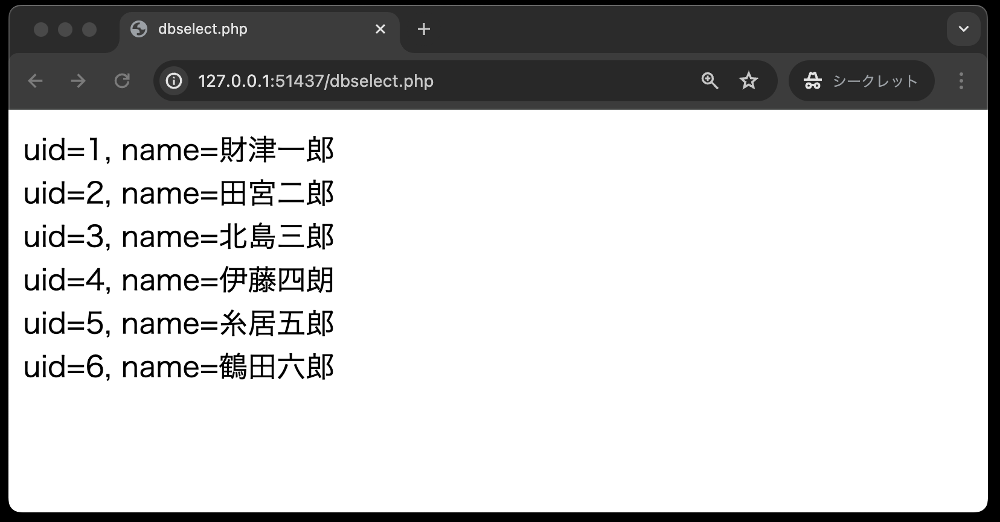

# データベースの利用(SELECT文)

データベースをプログラム上から利用するためには、SQL(Structured Query Language)という言語を使います。

SQLは、データベースに対して様々な操作を行うための言語であり、以下のような基本的な操作があります。

- SELECT文: テーブルからデータを抽出する
- INSERT文: テーブルにデータを挿入する
- UPDATE文: テーブルのデータ内容を更新する
- DELETE文: テーブルからデータを削除する

ここでは、まずSELECT文を使って、データベースからデータを抽出する方法について説明します。

## PDO（PHP　Data　Object）クラスの利用

PHPからデータベースを利用するには `PDO`（PHP Data Objects）クラスを使用します。
`PDO`クラスは、PHPからデータベースに接続するためのクラスであり、様々なデータベースに対応しています。

この`PDO`クラスのオブジェクトは以下の構文で作成します。
日本語の部分「接続するデータベースを利用するユーザー名」「そのパスワード」などは、接続するデータベース環境によって異なります。

```php
$user = '接続するデータベースを利用するユーザー名';
$password = 'そのパスワード';
$host = 'ホスト名';
$dbName = '接続するデータベース名';s
// dsn(Data Source Name(データソース名))は、プログラム側が操作対象のデータベースを指定するための識別名
$dsn = 'mysql:host=' . $host . ';dbname=' . $dbName . ';charset=utf8'; 
$pdo = new PDO($dsn, $user, $password);
```

```tips
- `$dsn`に設定する値には、決してスペースを間に入れないように！エラーが発生する場合があります！
- `$dsn`に設定する値で、「：」（コロン）と「；」（セミコロン）を間違わないように！
```

ちなみに、本章のデータベース環境は、`env.txt`に以下の通り設定されています。

```bash
MYSQL_ROOT_PASSWORD=root # rootユーザーのパスワード
MYSQL_DATABASE=SAMPLE # データベース名
MYSQL_USER=sampleuser # データベースに接続するユーザー名    
MYSQL_PASSWORD=samplepass # データベースに接続するユーザーのパスワード
```

また、ホスト名ですが、`composer.yml`に`db`というデータベースコンテナのサービス名が設定されています。
これがホスト名となります。

```yaml
  db:
    image: ghcr.io/densuke/mysql:main
    #build: db/build
    env_file:
      - env.txt
    volumes:
      - db_data:/var/lib/mysql
      - ./db:/docker-entrypoint-initdb.d
    healthcheck:
      test: ["CMD", "/usr/local/bin/healthcheck.sh"]
      interval: 30s
      timeout: 5s
      retries: 5
      start_period: 5s
```

これを元に、PDOクラスを設定すると以下のようになります。

```php
$user = 'sampleuser';
$password = 'samplepass';
$host = 'db';
$dbName = 'SAMPLE';
$dsn = 'mysql:host=' . $host . ';dbname=' . $dbName . ';charset=utf8';
$pdo = new PDO($dsn, $user, $password);
```

それでは、実際にデータベースに接続してみましょう。

## SELECT文によるデータベース操作

**dbselect.php**



```php
<!DOCTYPE html>
<html lang="ja">

<head>
    <meta charset="UTF-8">
    <meta name="viewport" content="width=device-width, initial-scale=1.0">
    <title>dbselect.php</title>
</head>

<body>
    <?php
    $user = 'sampleuser';
    $password = 'samplepass';
    $host = 'db';
    $dbName = 'SAMPLE';
    $dsn = 'mysql:host=' . $host . ';dbname=' . $dbName . ';charset=utf8';

    // 例外処理・・・①
    try {
        // PDOを用いてデータベースに接続する
        $pdo = new PDO($dsn, $user, $password);
    } catch (PDOException $e) {
        // 接続できなかった場合のエラーメッセージ
        exit('データベースに接続できませんでした：' . $e->getMessage());
    }

    // SQLの定義: personテーブルから全てのレコードを取得する
    $sql = 'SELECT * FROM person';

    // $pdoを用いて$sqlを実行する・・・②
    $stmt = $pdo->query($sql);
    // 実行結果を $results に格納する・・・③
    $results = $stmt->fetchAll();
    // 配列をループして、各要素を出力する 'uid=UID, name=NAME'の形式で
    foreach ($results as $row) {
        echo 'uid=' . $row['uid'] . ', name=' . $row['name'] . '<br>';
    }
    // データベースを切断する・・・④
    $pdo = null;
    ?>

</body>

</html>
```

**【解説】**

①: PDOオブジェクトを作成するときは、データベースへの接続不良等のの例外が発生する可能性があるので、`try ～ catch` 構文を利用します。

②: `$stmt = $pdo->query($sql);`<br>
単純なSELECT文を実行する場合には、`PDO`クラスの `query( )` メソッドを使用します。<br>
戻り値は「`PDOStatement`（ピー・ディー・オー・ステートメント）オブジェクト」です。<br>
`->`（ハイフンと小なり記号）は「シングルアロー」と読み、Javaの「．」（ドット演算子）に相当します。
つまり、 `$pdo` が`PDO`クラスのオブジェクトであり、このオブジェクトが持つ `query` メソッドを呼び出しているのです。

③: `$results = $stmt->fetchAll( );`<br>
`PDOStatement`クラスの`fetchAll( )`メソッドで、SELECT文で取り出したデータを連想配列の形式で取り出します。

④: `$pdo = null;`<br>
処理が終了した後はデータベースへの接続を閉じておきます。
